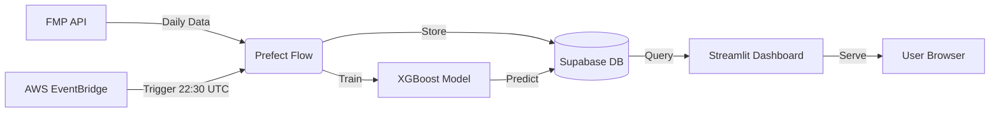

# 📈 AI-Powered Stock Prediction Dashboard


A production-grade, end-to-end Machine Learning application that predicts daily stock movements. Built with a modern data stack, containerized with Docker, and deployed serverlessly on AWS ECS Fargate.

## 🚀 Live Demo
*(Insert your Load Balancer URL or Domain here)*

## 🎯 Project Overview
This dashboard helps traders and analysts visualize stock performance and view AI-generated predictions for future price movements. It automates the entire ML lifecycle—from data ingestion to model training and deployment.

### Key Features
*   **automated Data Pipeline**: Daily ingestion of stock data via Financial Modeling Prep API, orchestrated by **Prefect**.
*   **Dynamic Retraining**: Models are automatically retrained every night on the latest data to adapt to market shifts.
*   **Advanced ML Model**: Uses **XGBoost** with custom feature engineering (Rolling Windows, VWAP distance, RSI, Seasonality).
*   **Interactive Dashboard**: Built with **Streamlit** and **Altair** for responsive, interactive charting and peer comparison.
*   **Cloud-Native Architecture**: Fully containerized and deployed on **AWS ECS Fargate** with EventBridge scheduling.

## 🏗️ Architecture



## 🛠️ Tech Stack

| Category | Technologies |
|----------|--------------|
| **Machine Learning** | XGBoost, Optuna (Hyperparameter Tuning), Pandas, NumPy |
| **Web App** | Streamlit, Altair |
| **Orchestration** | Prefect |
| **Database** | Supabase (PostgreSQL) |
| **Infrastructure** | AWS ECS (Fargate), ECR, EventBridge, Docker |
| **CI/CD & Code** | Python 3.11, Docker Compose, Git |

## 🧠 Model Details
The core prediction engine is an **XGBoost Regressor** optimized for time-series forecasting.
*   **Target**: Next-day Log Returns.
*   **Features**:
    *   **Technical Indicators**: VWAP Distance, Relative Volume, Candle Body Size, Shadows.
    *   **Lag Features**: 1, 2, 3, 5, 10-day lags of returns and volume.
    *   **Seasonality**: Cyclical encoding (Sine/Cosine) of Day-of-Week and Month.
*   **Evaluation**: Trained on 20+ years of historical data; monitored using RMSE, Directional Accuracy, and Sharpe Ratio.

## 💻 Local Development

1.  **Clone the repository**
    ```bash
    git clone https://github.com/yourusername/stock-dashboard.git
    cd stock-dashboard
    ```

2.  **Set up Environment Variables**
    Create a `.env` file:
    ```bash
    FMP_API_KEY=your_key
    SUPABASE_URL=your_url
    SUPABASE_KEY=your_key
    ```

3.  **Run with Docker Compose**
    ```bash
    docker-compose up --build
    ```
    *   Dashboard: `http://localhost:8501`
    *   Prefect UI: `http://localhost:4200`

## ☁️ Deployment (AWS)
The application is designed to be cloud-agnostic but is currently optimized for **AWS**.
1.  **Containerize**: Built multi-platform images (`linux/amd64`) pushed to Amazon ECR.
2.  **Compute**: Deployed on AWS ECS Fargate (Serverless Containers) for zero-maintenance scaling.
3.  **Scheduling**: Amazon EventBridge triggers the ingestion container every weeknight.
4.  **Networking**: Application Load Balancer (ALB) handles traffic and SSL termination.

## 🔮 Future Improvements
*   [ ] Add Sentiment Analysis from Financial News.
*   [ ] Implement LSTM/Transformer models for comparison.
*   [ ] Add email alerts for strong buy/sell signals.
